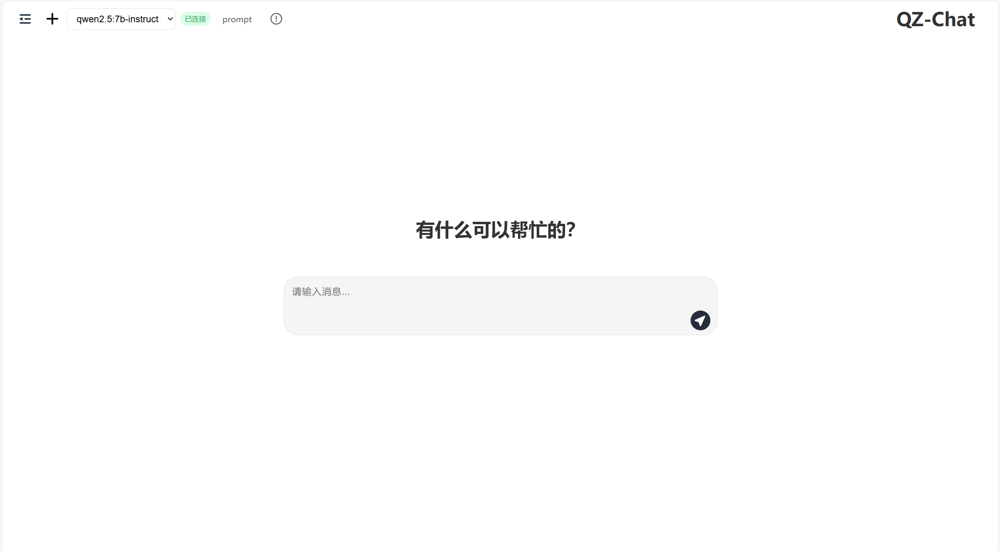

<div align="center">
<h1>QZ-Chat</h1>
<p>基于 Vue 3 开发的现代化聊天应用，支持多会话管理和 AI 对话。</p>


</div>

## 功能特点

- 💬 多会话管理
- 🤖 AI 对话支持
- 🎨 现代化 UI 设计
- 📱 响应式布局
- ⚡ 快速的消息响应
- 🔄 实时会话同步
- 📝 支持 Markdown 格式
- 💾 本地数据持久化

## 技术栈

- **前端框架**: Vue 3
- **路由管理**: Vue Router 4
- **HTTP 客户端**: Axios
- **开发工具**: Vue CLI
- **代码规范**: ESLint
- **包管理器**: npm/yarn

## 系统要求

- Node.js >= 16.0.0
- npm >= 8.0.0
- yarn >= 1.22.0
- 现代浏览器（Chrome, Firefox, Safari, Edge 等）
- - Ollama（必需）
  - ⚠️ 注意：当前版本仅支持 Ollama 作为 AI 对话后端
  - 请在运行应用前确保已安装并正确配置 Ollama
  - 从 [Ollama 官网](https://ollama.ai) 下载安装
  - 请确保 Ollama 服务正在运行
  - 启动命令：ollama serve
  - 查看模型列表：ollama list
  - 如果列表为空，请从官网下载模型
  - 建议下载7b及以下大小模型，模型的下载位置可以去网上找教程配置环境变量

## 开发环境设置

### 1. 安装必要工具

```bash
# 检查 Node.js 版本
node --version

# 检查 npm 版本
npm --version

# 检查 yarn 版本
yarn --version
```

### 2. 克隆项目

```bash
# 克隆仓库
git clone https://github.com/curtain28/QZ-Chat.git

# 进入项目目录
cd qz-chat
```

### 3. 安装依赖

```bash
# 使用 npm
npm install

# 或使用 yarn
yarn install
```

### 4. 启动开发服务器

```bash
npm run serve

# 项目将运行在 http://localhost:8080
```

## 部署说明

### 构建生产版本（不知道干嘛的可以忽略这个步骤）

```bash
# 构建生产版本
npm run build

# 启动生产服务器
npm start

# 生产服务器默认运行在 http://localhost:3000
```
### 部署注意事项

1. 确保服务器支持 SPA 应用的路由重写
2. 配置正确的 base URL
3. 确保所有环境变量正确设置
4. 确保 Ollama 服务正在运行
5. 生产服务器默认运行在 3000 端口
6. 如需更改端口，可以使用环境变量：`PORT=8080 npm start`


## 常见问题

### 1. 安装依赖失败
- 尝试删除 node_modules 和 package-lock.json
- 重新运行 npm install
- 确保 Node.js 版本正确

### 2. 运行开发服务器失败
- 检查端口 8080 是否被占用
- 确认所有依赖安装正确
- 检查环境变量配置

### 3. 启动服务器聊天记录为空
- 检查端口 8080 是否被占用
- 如果端口 8080 被占用会尝试使用端口 8081
- 不同端口之间聊天记录无法互通

### 4. 启动生产服务器时 serve 命令报错
如果运行 npm start 时出现类似以下 Python 相关错误：
```
ModuleNotFoundError: No module named 'attrs'
```
这说明系统中存在其他 serve 命令冲突。你可以选择以下任一解决方案：

1. 使用 npx 运行（推荐）：
   ```bash
   # 打开 package.json，找到 "scripts" 部分
   # 将 "start" 命令修改为：
   "start": "npx serve -s dist"
   ```

2. 切换到 http-server：
   ```bash
   # 先安装 http-server
   npm install http-server --save

   # 然后打开 package.json，找到 "scripts" 部分
   # 将 "start" 命令修改为：
   "start": "http-server dist"
   ```

修改后运行 npm start 即可启动生产服务器。注意：
- 使用 serve 默认端口为 3000
- 使用 http-server 默认端口为 8080
- 如需更改端口，可在命令后添加端口号，如：
  - serve: `"start": "serve -s dist -l 8000"`
  - http-server: `"start": "http-server dist -p 8000"`

## 许可证

[Apache-2.0 License](LICENSE)

## 联系方式

- 项目维护者：[curtain28]
